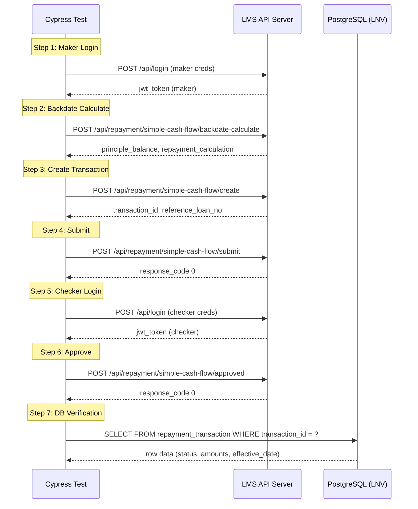

# Design Document: SCF Backdate E2E Test

## Overview

This design covers the Cypress E2E test automation for the SimpleCashFlow (SCF) Backdate Repayment maker-checker workflow. The test validates the full lifecycle: maker login → backdate calculation → create transaction → submit → checker login → approve → database verification.

The test follows the existing project patterns: `APIHelper` builder class for HTTP requests, `cy.fixture()` for test data, `Cypress.env()` for environment config, and `cy.task('queryDbLNV')` for database assertions.

### Design Rationale

- **Sequential `it()` blocks with shared closure variables**: Cypress executes `it()` blocks in order within a `describe()`. Shared `let` variables in the `describe` scope allow state (JWT tokens, transaction IDs) to flow between steps without custom plugins or file I/O.
- **APIHelper with `setReqHeadersWithAuth()`**: The existing helper already supports Bearer token injection via `setReqHeadersWithAuth(lang, token)`. This is used for authenticated requests after login.
- **Fixture-driven request bodies**: Keeps test data maintainable and environment-agnostic, matching the project convention.

## Architecture



### State Flow Between Steps

```mermaid
flowchart LR
    S1[Step 1: Maker Login] -->|makerToken| S2[Step 2: Backdate Calculate]
    S2 -->|makerToken| S3[Step 3: Create]
    S3 -->|transaction_id, reference_loan_no| S4[Step 4: Submit]
    S4 --> S5[Step 5: Checker Login]
    S5 -->|checkerToken| S6[Step 6: Approve]
    S6 -->|transaction_id| S7[Step 7: DB Verify]
```



## Components and Interfaces

### 1. Test File

**Path:** `cypress/e2e/lnv/scfRepayment/repaymentBackdate.cy.js`

**Responsibilities:**
- Orchestrates the 7-step maker-checker flow
- Manages shared state via closure variables
- Loads fixtures and asserts responses

**Interface with APIHelper:**
```javascript
import { APIHelper } from '../../../support/common/apiHelper';

const api = new APIHelper();
// For unauthenticated requests (login):
api.setReqMethod('POST').setReqEndpoint(url).setReqHeaders().setReqBody(body).sendRequest(alias);
// For authenticated requests:
api.setReqMethod('POST').setReqEndpoint(url).setReqHeadersWithAuth('en_US', token).setReqBody(body).sendRequest(alias);
```

### 2. APIHelper Class

**Path:** `cypress/support/common/apiHelper.js`

**Key methods used:**
| Method | Purpose |
|--------|---------|
| `setReqMethod(method)` | Sets HTTP method (always 'POST') |
| `setReqEndpoint(url)` | Sets full URL (`endPoint + apiPath`) |
| `setReqHeaders(lang)` | Sets Content-Type + Accept-Language (no auth) |
| `setReqHeadersWithAuth(lang, token)` | Sets headers with Bearer token |
| `setReqBody(body)` | Sets JSON request body |
| `sendRequest(alias)` | Executes `cy.request()` and aliases result |

### 3. Fixture Files

**Request bodies:**
```
cypress/fixtures/lnv/scfRepayment/reqBody/
├── bizLogic/
│   ├── backdateCalculate.json    # Backdate calculate request body
│   └── createBackdate.json       # Create SCF backdate request body
```

**Expected results:**
```
cypress/fixtures/lnv/scfRepayment/expResult/
├── bizLogic/
│   ├── backdateCalculateSuccess.json  # Expected calculate response fields
│   └── createBackdateSuccess.json     # Expected create response fields
```

### 4. Database Verification

**Access:** `cy.task('queryDbLNV', sqlQuery)` — connects to PostgreSQL via the `pg` client configured in `cypress.config.js`.

**Query pattern:**
```sql
SELECT * FROM repayment_transaction 
WHERE transaction_id = '{transaction_id}' 
LIMIT 1
```

### 5. Environment Configuration

**Required `Cypress.env()` variables:**

| Variable | Source | Purpose |
|----------|--------|---------|
| `endPoint` | `.env` (`ENDPOINT`) or `cypress/config/{env}.json` | Base API URL |
| `makerUsername` | `.env` or config | Maker login username |
| `makerPassword` | `.env` or config | Maker login password |
| `checkerUsername` | `.env` or config | Checker login username |
| `checkerPassword` | `.env` or config | Checker login password |

**Database config (from `.env`):**
- `DB_LNV_HOST`, `DB_LNV_PORT`, `DB_LNV_USER`, `DB_LNV_PASSWORD`, `DB_LNV_NAME`, `DB_LNV_SCHEMA_NAME`

## Data Models

### Shared Test State (Closure Variables)

```javascript
describe('SCF Backdate Repayment Flow', () => {
  let makerToken;         // JWT from Step 1
  let checkerToken;       // JWT from Step 5
  let transactionId;      // From Step 3 response
  let referenceLoanNo;    // From Step 3 response
  let createReqBody;      // Stored for DB comparison
});
```

### API Request/Response Models

**Login Request:**
```json
{
  "username": "string",
  "password": "string"
}
```

**Login Response (success):**
```json
{
  "response_code": 0,
  "response_message": "Success",
  "data": {
    "jwt_token": "string"
  }
}
```

**Backdate Calculate Request:**
```json
{
  "channel": "WEB",
  "transaction_owner_id": "331",
  "effective_date": "2025-01-15",
  "loan_contract_id": "string",
  "repayment_amount": 5000.00,
  "calculation_period": "string",
  "need_close_account": false
}
```

**Backdate Calculate Response (success):**
```json
{
  "response_code": 0,
  "data": {
    "principle_balance": 50000.00,
    "repayment_calculation": { ... },
    "effective_date_calculation": "2025-01-15"
  }
}
```

**Create Request:**
```json
{
  "channel": "WEB",
  "transaction_owner_id": "331",
  "transaction_eff_date": "2025-01-15",
  "loan_contract_id": "string",
  "repayment_amount": 5000.00,
  "principal": 4000.00,
  "interest": 800.00,
  "penalty": 100.00,
  "fee": 100.00,
  "need_close_account": false
}
```

**Create Response (success):**
```json
{
  "response_code": 0,
  "data": {
    "transaction_id": "string",
    "reference_loan_no": "string"
  }
}
```

**Submit Request:**
```json
{
  "channel": "WEB",
  "transaction_owner_id": "331",
  "transaction_id": "string"
}
```

**Approve Request:**
```json
{
  "channel": "WEB",
  "transaction_owner_id": "238",
  "transaction_id": "string",
  "reference_loan_no": "string",
  "eff_date": "2025-01-15T00:00:00+07:00"
}
```

### Database Row (repayment_transaction)

| Column | Type | Verified Against |
|--------|------|-----------------|
| `transaction_id` | string | Create response |
| `transaction_status` | string | Expected: 'Approved' |
| `effective_date` | date | Create request body `transaction_eff_date` |
| `principal` | numeric | Create request body `principal` |
| `interest` | numeric | Create request body `interest` |
| `penalty` | numeric | Create request body `penalty` |
| `fee` | numeric | Create request body `fee` |

## Error Handling

### Pre-condition Guards

Each step validates its prerequisites before executing:

| Step | Guard Condition | Failure Behavior |
|------|-----------------|------------------|
| Step 2 (Calculate) | `makerToken` must be non-null | `expect(makerToken).to.not.be.undefined` — fails with clear message |
| Step 3 (Create) | `makerToken` must be non-null | Same as above |
| Step 4 (Submit) | `transactionId` must be non-empty string | `expect(transactionId).to.be.a('string').and.not.be.empty` |
| Step 5 (Checker Login) | Submit step passed | Cypress sequential execution ensures ordering |
| Step 6 (Approve) | `checkerToken`, `transactionId`, `referenceLoanNo` all non-null | Guard assertions at start of step |
| Step 7 (DB Verify) | `transactionId` must be non-null | Guard assertion before query |

### API Error Handling

Every API call uses `failOnStatusCode: false` (set in `APIHelper.sendRequest()`), so Cypress won't throw on non-200 responses. The test explicitly asserts:

```javascript
expect(res.status).to.eq(200);
expect(res.body.response_code).to.eq(0);
```

If either assertion fails, Cypress reports the step name, HTTP status, and full response body via `cy.log()` before the failure.

### Timeout Configuration

- `requestTimeout: 90000` (90s) — configured globally in `cypress.config.js`
- `responseTimeout: 90000` (90s) — matches the requirement for checker login timeout
- `APIHelper.sendRequest()` sets `timeout: 90000` per request

### Environment Variable Validation

The test validates required env vars at the start:
```javascript
before(() => {
  expect(Cypress.env('makerUsername'), 'makerUsername env var').to.not.be.undefined;
  expect(Cypress.env('makerPassword'), 'makerPassword env var').to.not.be.undefined;
  expect(Cypress.env('checkerUsername'), 'checkerUsername env var').to.not.be.undefined;
  expect(Cypress.env('checkerPassword'), 'checkerPassword env var').to.not.be.undefined;
});
```

## Correctness Properties

This feature is an E2E integration test with deterministic expected behavior. Formal property-based testing does not apply because the test exercises external APIs and a real database with fixed fixture inputs. However, the following invariants are verified at runtime:

### Property 1: Sequential Step Dependency

Each step N must complete with `response_code === 0` before step N+1 executes. If any step fails, subsequent steps that depend on its outputs will also fail with a clear prerequisite error.

**Validates: Requirements 2.1, 3.1, 4.1, 5.1, 6.1**

### Property 2: Maker-Checker Separation

The maker JWT token and checker JWT token must belong to different users. The test verifies that `makerUsername !== checkerUsername` before the approve step.

**Validates: Requirements 6.4**

### Property 3: Data Integrity After Approval

After the full flow completes, the database row for the transaction must reflect the exact values sent in the create request (amounts, effective_date) and the final status must be 'Approved'.

**Validates: Requirements 7.3, 7.4, 7.5**

### Property 4: Token Validity Guard

Every authenticated API call must use a non-null, non-empty Bearer token. The test guards against undefined tokens before making requests.

**Validates: Requirements 1.2, 2.5, 3.5, 5.4**

### Property 5: Unique Transaction Record

The DB verification step queries by `transaction_id` (unique key), ensuring exactly 1 row is returned regardless of when the test runs.

**Validates: Requirements 7.1, 7.2**

## Testing Strategy

### Why PBT Does Not Apply

This feature is an **E2E integration test** that exercises external APIs and a database. It:
- Tests infrastructure wiring (API server, PostgreSQL)
- Has deterministic expected behavior for each step (fixed response codes, fixed DB state)
- Does not have a large input space — request bodies are fixed fixtures
- Involves high-cost operations (real HTTP calls, real DB queries)

Property-based testing is not appropriate. The testing strategy uses **example-based integration tests** with database verification.

### Test Structure

**Single spec file:** `cypress/e2e/lnv/scfRepayment/repaymentBackdate.cy.js`

**Test organization:**
```javascript
describe('SCF Backdate Repayment - Maker-Checker Flow', () => {
  before()       // Validate env vars
  it('Step 1')   // Maker login
  it('Step 2')   // Backdate calculate
  it('Step 3')   // Create transaction
  it('Step 4')   // Submit
  it('Step 5')   // Checker login
  it('Step 6')   // Approve
  it('Step 7')   // DB verification
});
```

### Assertions Per Step

| Step | Key Assertions |
|------|---------------|
| 1. Maker Login | `status === 200`, `response_code === 0`, `jwt_token` is non-empty string |
| 2. Calculate | `status === 200`, `response_code === 0`, `data` contains `principle_balance`, `repayment_calculation`, `effective_date_calculation` |
| 3. Create | `status === 200`, `response_code === 0`, `transaction_id` and `reference_loan_no` extracted |
| 4. Submit | `status === 200`, `response_code === 0` |
| 5. Checker Login | `status === 200`, `response_code === 0`, `jwt_token` is non-empty string |
| 6. Approve | `status === 200`, `response_code === 0` |
| 7. DB Verify | Row exists, `transaction_status === 'Approved'`, `effective_date` matches, amounts match |

### Running the Test

```bash
# Run against UAT environment
npx cypress run --spec "cypress/e2e/lnv/scfRepayment/repaymentBackdate.cy.js" --env configFile=test

# Run with explicit credentials
npx cypress run --spec "cypress/e2e/lnv/scfRepayment/repaymentBackdate.cy.js" \
  --env makerUsername=maker01,makerPassword=pass,checkerUsername=checker01,checkerPassword=pass
```

### Evidence Recording

The existing `afterEach` hook in `cypress/support/e2e.js` automatically records test results to the Excel evident report. Each `it()` step generates a row with PASSED/FAILED status.
